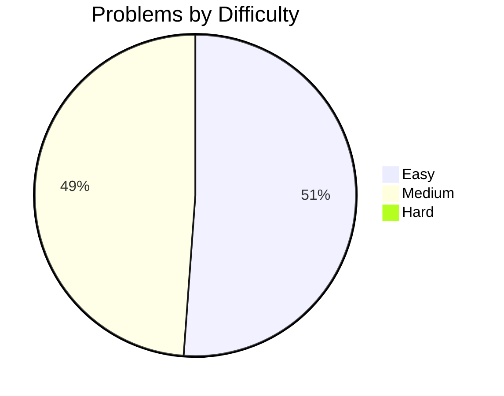
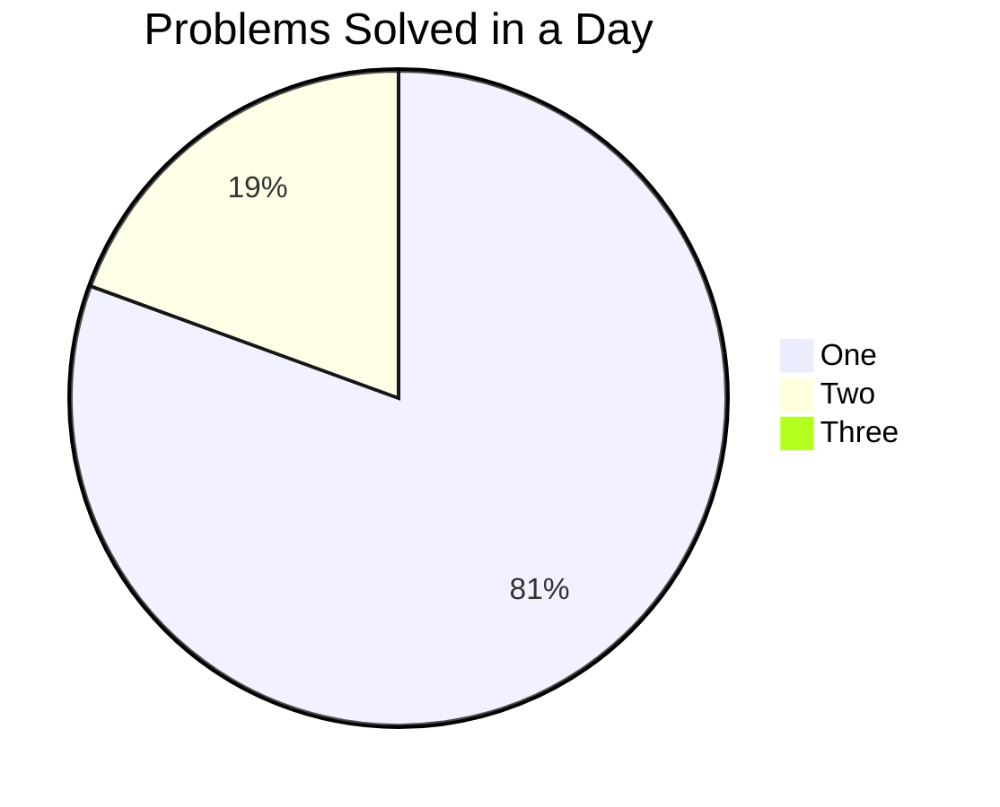

# 100 days of DSA
This isn't meant to be a continuous 100 days streak where i do DSA every day for 100 days straight since that isn't really possible for me because im participating in GSOC and also even without GSOC, college alone makes it really difficult to do anything like this, but I'll try my best to be as continuous as possible.

## Goal:
* My goal is to basically do 100 days of DSA not continuously but just 100 days with as less discontinuation as possible
* I see this as a good way to regulate my placement preperation as, although i consider myself to be a decently skilled engineer of my speciality (AI/ML/Python), with my current portfolio I'd most definelty struggle to land a job because I've basically never touched DSA properly although i have made attempts before
* Ideally I'll try to devote 30-60 minutes daily and at the end of each session update my progress on GitHub so a timeline of my work becomes visible and it becomes easier for myself (and maybe others if someone is interested in my resume or something) to quantify my work
* I plan on documenting each day's work with a seperate markdown file for each day, sort of like a diary
* I haven't put much thought into what sheet or course I'll follow. I'll just do ApnaCollege's DSA sheet since i remember it being free and somewhat popular
* I think I'll only do easy-medium questions from the sheet and mostly easy, because I think at my stage continuity matters more than anything else

## Resources
* sheet im following: [DSA by Shradha Ma'am](https://www.youtube.com/redirect?event=video_description&redir_token=QUFFLUhqbkZybHBuWldVQThBejYzdkc1RnItZHlNR2RFd3xBQ3Jtc0ttWFgtY3RwZnVqRDVZb0ZkRU5XeW45Mi10dDh3NWVDX1ByX29wbFVicTBNT0VBVEI5XzhHYjl5ZWp1WFdRNDFxbS1ZanZqMUlWZTIySXRhbF9GU3FKMmt2dExiNFQ3Y0FaLUpZeF81dE9telJtU1Qwdw&q=https%3A%2F%2Fbit.ly%2FDSAbyApnaCollege&v=u6Xsayqxij0)

I'll update this markdown file if there are any other resources I follow.

## Progress
Problem counter: 43 Problems

| sr no | day | problem solved | difficulty |
|---|---|---|---|
| 1 | 1 | [minimum and maximum in an array](https://github.com/Jasjeet-Singh-S/100-days-DSA/blob/main/day_001/min_and_max_in_array.py) | easy
| 2 | 2 | [reverse the array](https://github.com/Jasjeet-Singh-S/100-days-DSA/blob/main/day_002/reverse_array.py) | easy
| 3 | 3 | [contains duplicate](https://github.com/Jasjeet-Singh-S/100-days-DSA/blob/main/day_003/duplicate_checker.py) | easy
| 4 | 4 | [chocolate problem](https://github.com/Jasjeet-Singh-S/100-days-DSA/blob/main/day_004/chocolate_problem.py) | easy
| 5 | 5 | [search in rotated sorted array](https://github.com/Jasjeet-Singh-S/100-days-DSA/blob/main/day_005/search_rotated_sorted_arr.py) | easy
| 6 | 6 | [maximum subarray](https://github.com/Jasjeet-Singh-S/100-days-DSA/blob/main/day_006/maximum_subarray.py) | easy
| 7 | 7 | [valid palindrome](https://github.com/Jasjeet-Singh-S/100-days-DSA/blob/main/day_007/palindrome.py) | easy
| 8 |   | [valid anagram](https://github.com/Jasjeet-Singh-S/100-days-DSA/blob/main/day_007/anagram.py) | easy
| 9 | 8 | [valid parenthesis](https://github.com/Jasjeet-Singh-S/100-days-DSA/blob/main/day_008/valid_parenthesis.py) | easy
| 10 |   | [remove consecutive characters](https://github.com/Jasjeet-Singh-S/100-days-DSA/blob/main/day_008/remove_consec_chars.py) | easy
| 11 | 9 | [longest common prefix](https://github.com/Jasjeet-Singh-S/100-days-DSA/blob/main/day_009/longest_common_prefix.py) | easy 
| 12 |   | [mobile numeric keypad](https://github.com/Jasjeet-Singh-S/100-days-DSA/blob/main/day_009/mob_num_keypad.py) | easy
| 13 | 10 | [set matrix zeros](https://github.com/Jasjeet-Singh-S/100-days-DSA/blob/main/day_010/set_mat_zero.py) | medium
| 14 | 11 | [spiral order matrix](https://github.com/Jasjeet-Singh-S/100-days-DSA/blob/main/day_011/spiral_order.py) | medium
| 15 |   | [rotating matrix 90 degrees](https://github.com/Jasjeet-Singh-S/100-days-DSA/blob/main/day_011/rotate_mat_optimal.py) | medium
| 16 | 12 | [word search](https://github.com/Jasjeet-Singh-S/100-days-DSA/blob/main/day_012/word_search.py) | medium
| 17 | 13 | [count islands](https://github.com/Jasjeet-Singh-S/100-days-DSA/blob/main/day_013/num_islands.py) | medium
| 18 |   | [permutation pair sum](https://github.com/Jasjeet-Singh-S/100-days-DSA/blob/main/day_013/permutation_pair_sum.py) | easy
| 19 | 14 | [pair with k difference naive approach](https://github.com/Jasjeet-Singh-S/100-days-DSA/blob/main/day_014/pair_with_diff_naive.py) | easy
| 20 | 15 | [pair with k difference optimal approach](https://github.com/Jasjeet-Singh-S/100-days-DSA/blob/main/day_015/pair_with_diff_optimal.py) | easy
| 21 | 16 | [ceiling in a sorted array](https://github.com/Jasjeet-Singh-S/100-days-DSA/blob/main/day_016/ceiling_sorted_arr.py) | easy
| 22 | 17 | [replace "O" if surrounded by "X"](https://github.com/Jasjeet-Singh-S/100-days-DSA/blob/main/day_017/replace_O_w_X.py) | medium
| 23 | 18 | [reverse linked list](day_018/reverse_LL.py) | easy
| 24 | 19 | [next permutation brute force](day_019/next_permutation.py) | medium
| 25 | 20 | [linked list cycle](day_020/linked_list_cycle.py) | easy
| 26 | 21 | [merging sorted linked list](day_021/merge_linked_list.py) | easy
| 27 | 22 | [delete without head node](day_022/del_wo_head_ptr.py) | easy
| 28 | 23 | [remove duplicates from unsorted linked list](day_023/del_duplicate_nodes.py) | easy
| 29 | 24 | [multiply two numbers represented linked lists](day_024/multiply_linked_list.py) | easy
| 30 | 25 | [remove nth node from the end of linked list naive approach](day_025/remove_nth_from_end_naive.py) | medium
| 31 | 26 | [remove nth node from the end of linked list optimal approach](day_026/remove_nth_from_end_opt.py) | medium
| 32 |    | [remove loop from linked list](day_026/remove_loop.py) | medium
| 33 | 27 | [intersecting linked lists](day_027/intersection.py) | medium 
| 34 | 28 | [best time to buy and sell stock](day_028/buy_sell_stock.py) | medium
| 35 | 29 | [repeated and missing number](day_029/repeat_and_missing.py) | medium
| 36 | 30 | [repeated and missing number optimal approach](day_030/repeated_and_missing_optimal.py) | medium
| 37 |    | [k'th largest element heap approach](day_030/kth_largest_element.py) | medium 
| 38 | 31 | [k'th largest element using quick select](day_031/quickselect.py) | medium
| 39 | 32 | [reverse a doubly linked list](day_032/reverse_DLL.py) | medium
| 40 | 33 | [delete node with greater node on right](day_033/del_node_w_greater_right.py) | medium
| 41 | 34 | [trapping rain water](day_034/rain_water.py) | medium 
| 42 | 35 | [product except self](day_035/product.py) | medium
| 43 | 36 | [lobgest substring without repeating characters](day_036/substrng_no_rep.py) | medium